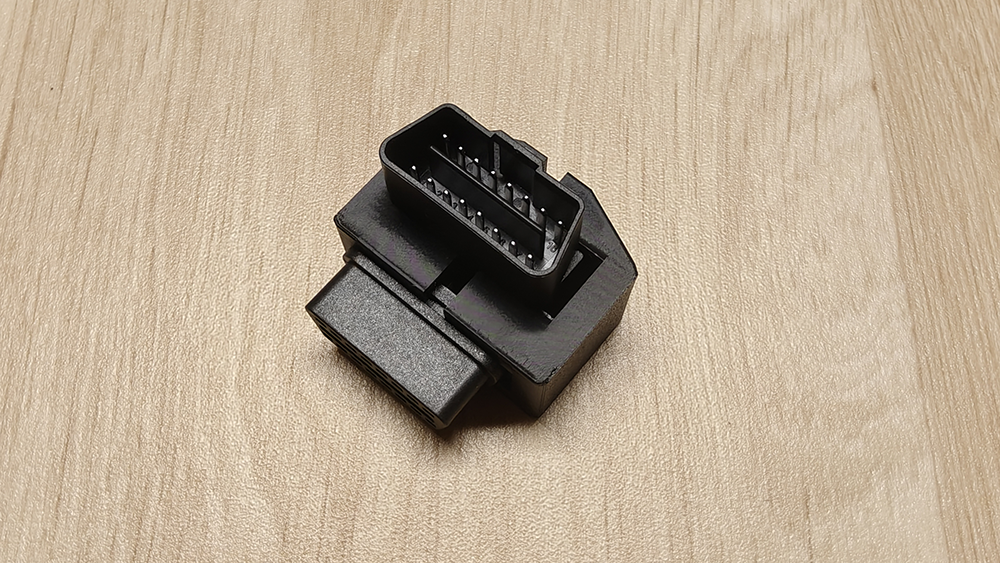
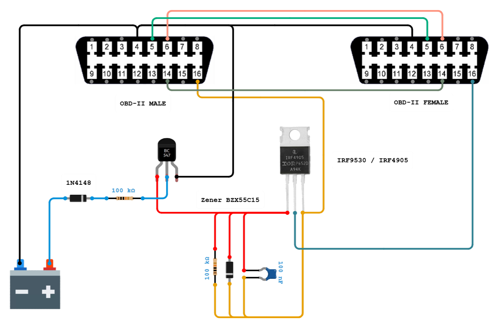
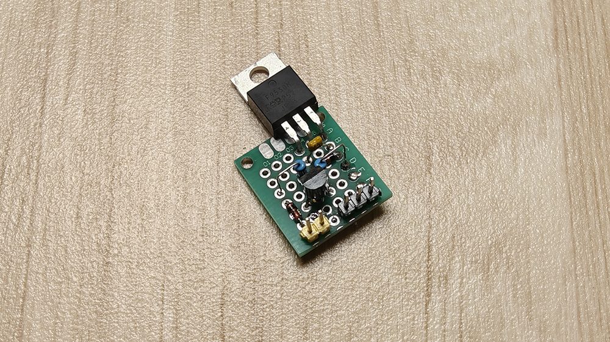
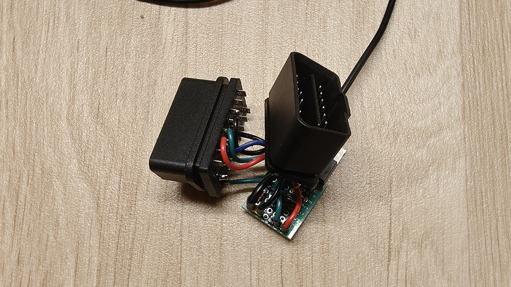
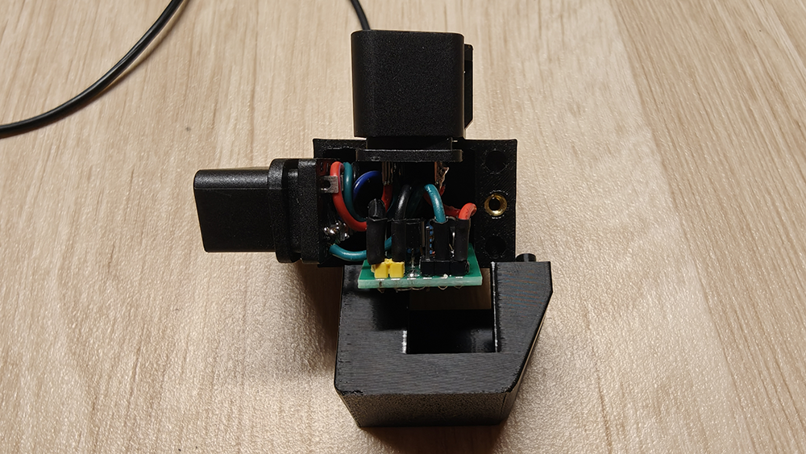
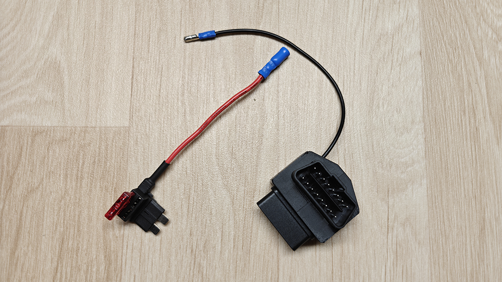
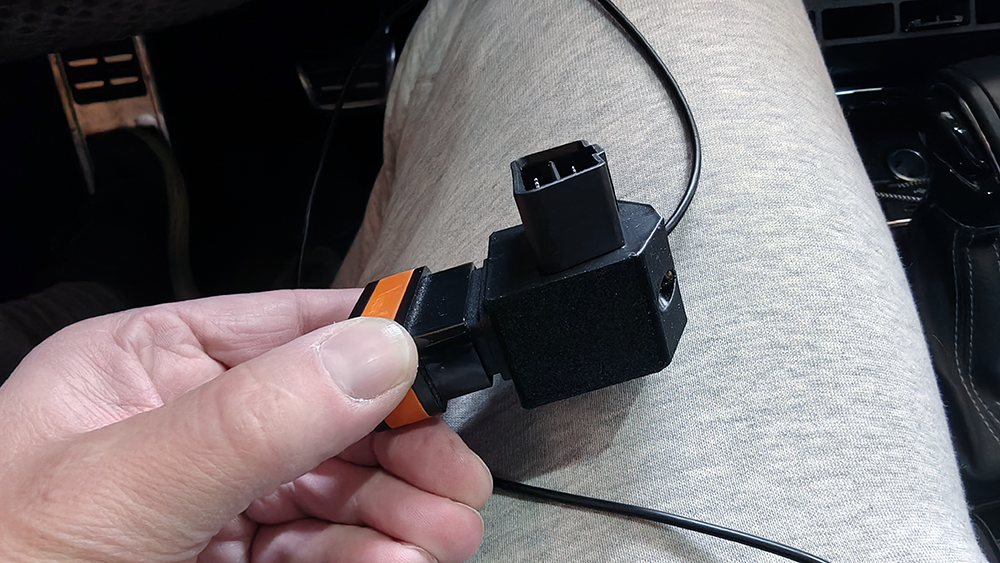
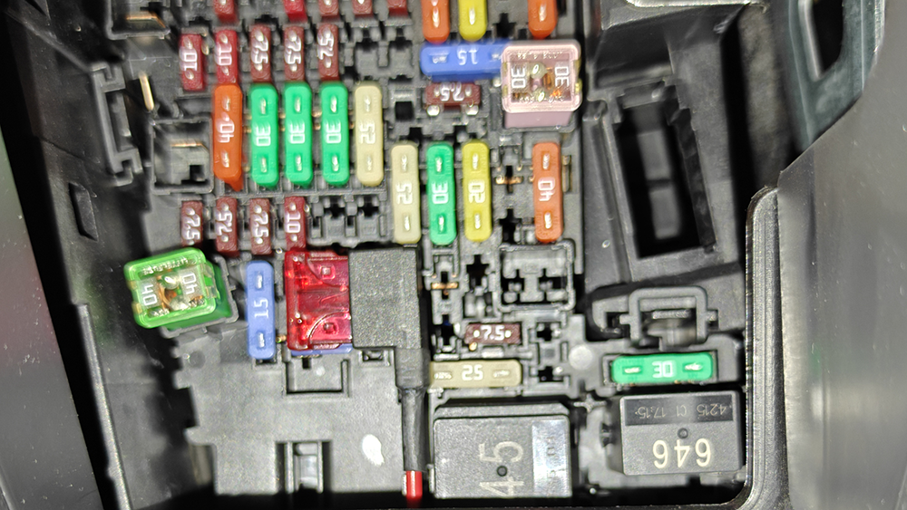
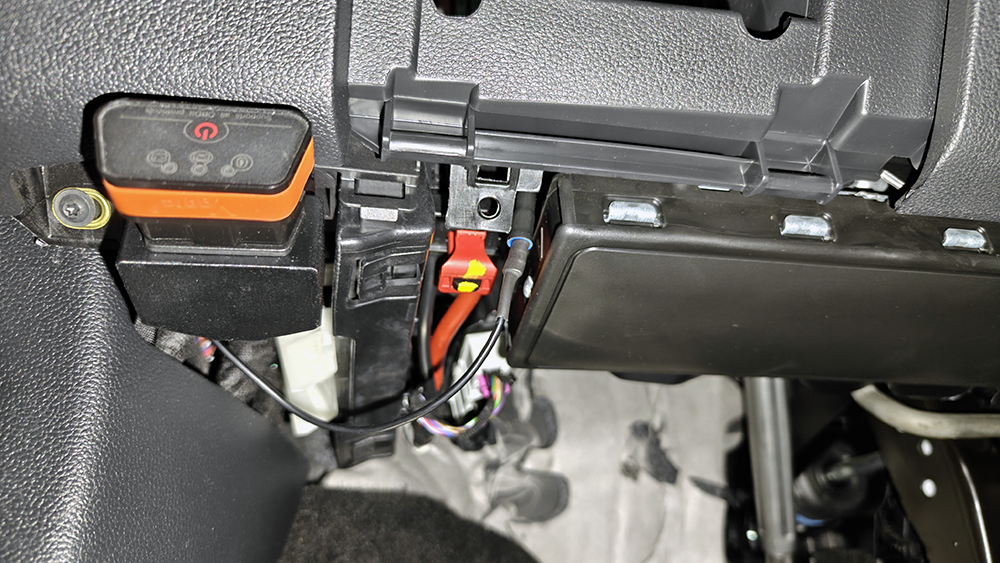
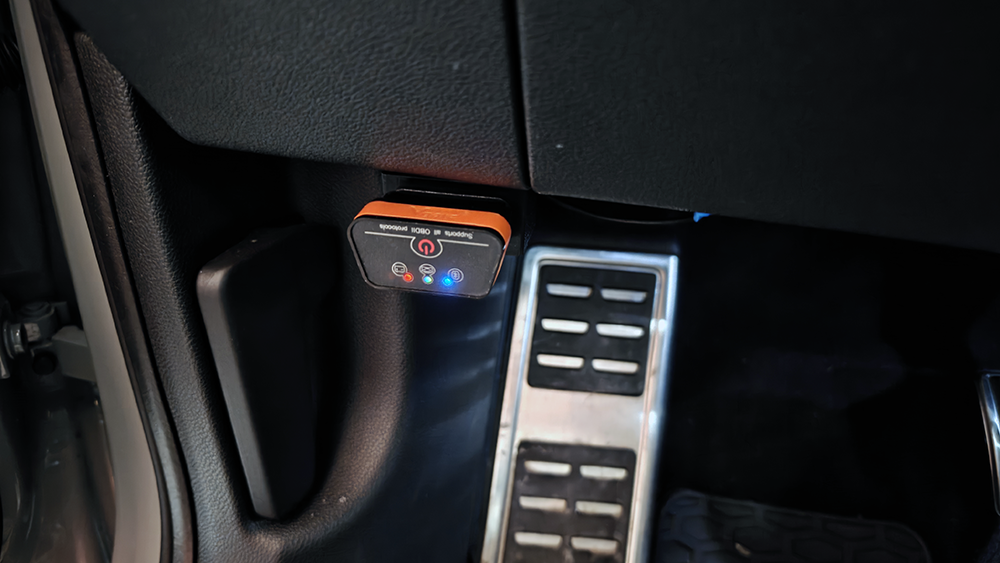

# Automatické spínání OBD napájení (ochrana proti vybití baterie)

Tento modul slouží k tomu, aby se diagnostický adaptér (např. **VGATE**, **ELM327**) v OBD zásuvce zapínal pouze tehdy, když je auto nastartované nebo je zapnuté zapalování. 

 

Běžně je totiž **pin 16 v OBD zásuvce pod trvalým proudem 12 V** z autobaterie, což znamená, že zapojený adaptér buď neustále odebírá proud, nebo se sám uspí, ale po novém nastartování se musí probudit tlačítkem (např. VGATE).

---

## 🚗 O projektu & Využití

Tento mezikus se zapojí mezi auto (**OBD-II Female**) a adaptér (**OBD-II Male**) a kompletně odpojuje napájení, když auto spí. Díky tomu můžete nechat adaptér v autě zapojený **klidně 365 dní v roce**.

To je ideální, pokud používáte **Android rádio / displej** v autě:
- Adaptér se po nastartování sám spáruje.
- Data z auta (teploty, tlaky, otáčky, chybové kódy) máte zobrazená přímo na displeji palubní desky.
- Funguje skvěle s aplikacemi jako **VAG DPF**, **Car Scanner**, **Torque**, **RealDash** apod. bez jakéhokoliv ručního zapínání.

* 🖨️ **3D Tisk & Krabička:** Pro profesionální vzhled v autě si můžete vytisknout vlastní krabičku:
  * Model ke stažení: [OBD 90 degree adapter na Printables.com](https://www.printables.com/model/1563102-obd-90-degree-adapter)
---

## ⚡ Jak to funguje?

  

Celý obvod funguje jako **elektronické relé**, které reaguje na spínané napětí z auta (např. od zapalování, okruhu stěračů, rádia atd.).

1. **Vstupní signál (Modrý vodič):**  
   Tento vodič připojíte v autě na místo, kde se objeví `+12 V` až po otočení klíčku (případně po odemčení auta).
2. **Řídicí tranzistor (BC547):**  
   Jakmile na modrý vodič dorazí napětí, tento malý NPN tranzistor se „otevře“ a propojí řídicí nožičku (*Gate*) velkého tranzistoru se zemí (mínusem).
3. **Výkonový tranzistor (IRF4905):**  
   Jedná se o robustní P-kanálový MOSFET, který funguje jako hlavní vypínač. Když ho malý tranzistor uzemní, MOSFET sepne a pustí plných `12 V` z autobaterie přímo do pinu 16 na diagnostice (oranžový / tmavě modrý vodič).
4. **Vypnutí:**  
   Jakmile vypnete zapalování a na modrém drátu zmizí napětí, oba tranzistory se zavřou a adaptér je kompletně bez proudu.

---

## 🛠️ Seznam součástek a jejich význam

| Součástka | Typ / Hodnota | Popis a funkce v obvodu |
| :--- | :--- | :--- |
| **P-MOSFET** | `IRF4905` (případně `IRF9530`) | **Výkonový spínač.** IRF4905 je předimenzovaný (snese obrovský proud), takže se v tomto zapojení vůbec nezahřívá. |
| **NPN Tranzistor** | `BC547` | **Řídicí tranzistor.** Ovládá velký MOSFET. Sám o sobě by napájení diagnostiky neutáhl, ale jako „přepínač přepínače“ je ideální. |
| **Dioda** | `1N4148` (na vstupu) | Pouští proud pouze jedním směrem. Chrání citlivý tranzistor před případným přepólováním nebo zpětnými impulsy z palubní sítě. |
| **Rezistor** | `100 kΩ` (na vstupu) | Omezuje proud tekoucí do malého tranzistoru, aby neshořel. |
| **Zenerova dioda** | `BZX55C15` (15 V) | **Kritická ochrana.** Hlídá, aby napětí na řídicí nožičce (*Gate*) velkého MOSFETu nepřekročilo bezpečnou mez při napěťových špičkách. |
| **Rezistor** | `100 kΩ` (mezi G a S) | Zajišťuje, aby se velký tranzistor spolehlivě a rychle vypnul, jakmile ztratí řídicí signál. |
| **Kondenzátor** | `100 nF` | Vyhlazuje drobné zákmity a šumy v elektrické síti auta (např. při testování žárovek řídicí jednotkou). |

---

## 💡 Praktické rady pro stavbu

* **Pojistka:** Je nanejvýš vhodné dát na červený přívodní vodič z baterie pouzdro s autopojistkou (bohatě stačí `2 A` až `5 A`, adaptér bere minimum). Ochrání to kabeláž auta v případě zkratu při pájení. 
  > *Tip:* Lze použít pojistkovou odbočku např. na pojistku zadního stěrače. Přívodní vodič stačí pouze plusový, mínus je vyveden z OBD konektoru.
* **Zbytkové napětí:** U některých aut (např. koncern VW) může na spínaném okruhu po vypnutí motoru zůstat malé napětí (kolem `0,8 V`), dokud jednotky neusnou. Obvod je na to navržen a díky úbytku napětí na diodě `1N4148` toto malé napětí modul nesepne – adaptér se vypne správně.
* **Zapojení pinů (Pinout):** Při pájení si dejte pozor na správné otočení nožiček tranzistorů (vždy si zkontrolujte jejich datasheet). Prohození nožiček je nejčastější důvod, proč obvod napoprvé nefunguje.
* **Konstrukce:** Pro stavbu lze použít univerzální plošný spoj. Vhodné je navrhnout a vytisknout krabičku / adaptér na OBD konektor (konektory lze snadno pořídit např. z AliExpressu).

---
<table>
  <tr>
    <td align="center"></td>
    <td align="center"></td>
    <td align="center"></td>
    <td align="center"></td>
  </tr>
  <tr>
    <td align="center"></td>
    <td align="center"></td>
    <td align="center"></td>
    <td align="center"></td>
  </tr>
</table>

